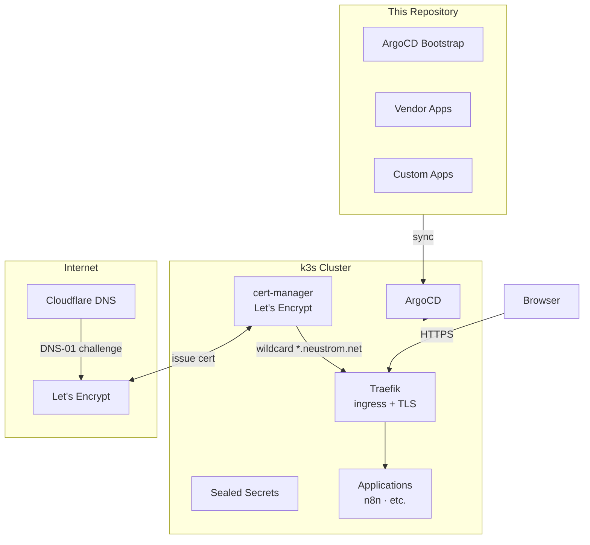

# Home Lab

A GitOps mono-repo for household automation running on k3s. The cluster hosts apps like n8n (workflow automation), cost tracking tools, and whatever else the household needs — all managed declaratively through Git.

ArgoCD watches this repository and syncs changes to the cluster automatically. Infrastructure, application config, and secrets all live here.

## Architecture



## Structure

```
ansible/              Server provisioning playbooks
applications/
  bootstrap/argocd/   ArgoCD install (applied manually once)
  vendor/             Third-party apps managed by ArgoCD
    sealed-secrets/   Encrypted secrets in Git
    cert-manager/     Automatic TLS via Let's Encrypt
    traefik-certs/    Wildcard certificate + TLSStore
  custom/             Self-hosted apps (images on ghcr.io)
infrastructure/       Infrastructure definitions
docs/                 MkDocs documentation site
scripts/              Helper scripts (secret sealing)
certs/                Sealed Secrets public key (safe to commit)
```

## Getting Started

Install tools with [mise](https://mise.jdx.dev/):

```bash
mise install
```

Available tasks:

```bash
mise run docs          # Serve documentation locally (http://localhost:8000)
mise run fetch-cert    # Pull the Sealed Secrets public key from the cluster
mise run seal-secret   # Encrypt a .env file into a SealedSecret
```

## Secrets

Secrets are encrypted before committing using [Sealed Secrets](https://github.com/bitnami-labs/sealed-secrets). The encrypted file is safe to store in this public repository — only the cluster can decrypt it.

To seal a new secret:

1. Create a `.env` file with `KEY=value` entries (never commit this file)
2. `mise run seal-secret` — prompts for name, namespace, and env file
3. Move the output `<name>-sealedsecret.yaml` into the relevant app directory
4. Add it to the app's `kustomization.yaml` and push

After re-installing the cluster, run `mise run fetch-cert` first to get the new public key, then re-seal all secrets.

## Documentation

Full documentation lives in `docs/`. To browse it:

```bash
mise run docs
```

Then open [http://localhost:8000](http://localhost:8000).
