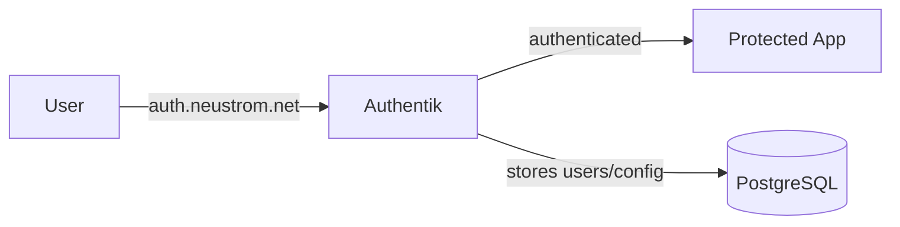

# Authentik

Authentik is an identity provider — it handles user accounts, logins, and
access control for all the other applications in the cluster. Think of it
as the "bouncer" that decides who is allowed to use what.

## Why it exists

Without Authentik, every application would need its own login system.
Authentik provides a single sign-on (SSO) experience: you log in once at
`auth.neustrom.net` and all connected applications recognise you.

It can also protect applications that have no built-in login at all, by
sitting in front of them and requiring authentication before traffic is
allowed through (this is called *forward authentication*).

## How it works

- **Authentik server** runs in the `authentik` namespace and handles the
  web UI, API, and authentication flows.
- **PostgreSQL** stores all user accounts, groups, and configuration. It
  runs outside the cluster (managed by Pulumi) and is reached via the
  `postgres.databases.svc.cluster.local` service.
- **Forward-auth middleware** is a Traefik middleware that intercepts
  requests to other apps, checks with Authentik whether the user is
  logged in, and either lets the request through or redirects to the
  login page.

## Key details

| Key | Value |
| --- | --- |
| Namespace | `authentik` |
| URL | [auth.neustrom.net](https://auth.neustrom.net) |
| Helm chart | `authentik` from `charts.goauthentik.io` |
| Database | `authentik` (dedicated, managed by Pulumi) |
| Secrets | `authentik-application-secrets` (SealedSecret with DB password and secret key) |
