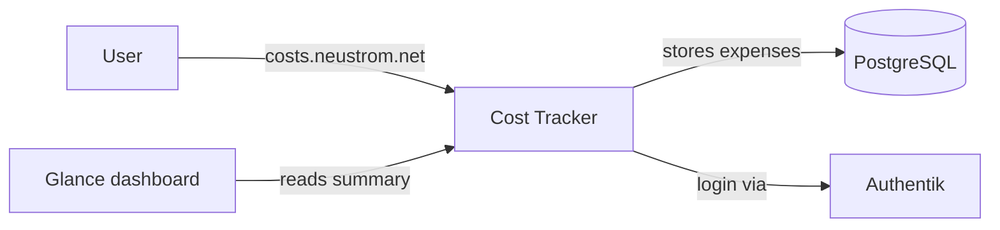

# Cost Tracker

Cost Tracker is a household expense-sharing application. It helps two
partners track shared costs, see who owes whom, and settle up at the end
of each month.

## Why it exists

When two people share expenses, someone always ends up paying more than
their share. Cost Tracker keeps a running balance so both partners can
log purchases throughout the month and see a clear summary of what needs
to be settled.

## How it works

- **Cost Tracker** runs in the `cost-tracker` namespace and provides
  a web UI for logging expenses and viewing balances.
- **PostgreSQL** stores all expense data. The database runs outside the
  cluster (managed by Pulumi) and is reached via the
  `postgres.databases.svc.cluster.local` service.
- **Authentik** handles login via OpenID Connect (OIDC) — you sign in
  with the same account used for all other home lab apps.
- **Glance** can display a finance summary widget on the dashboard by
  calling the Cost Tracker API.

## Key details

| Key | Value |
| --- | --- |
| Namespace | `cost-tracker` |
| URL | [costs.neustrom.net](https://costs.neustrom.net) |
| Image | `ghcr.io/golgor/cost-tracker:1.0.0` |
| Port | 8000 |
| Database | `cost-tracker` (dedicated, managed by Pulumi) |
| Auth | OIDC via Authentik |
| Secrets | `cost-tracker-secrets` (SealedSecret with DB URL, OIDC credentials, API keys) |
| Config | ConfigMap `cost-tracker-config` (`LOG_LEVEL`, `ENV`) |
