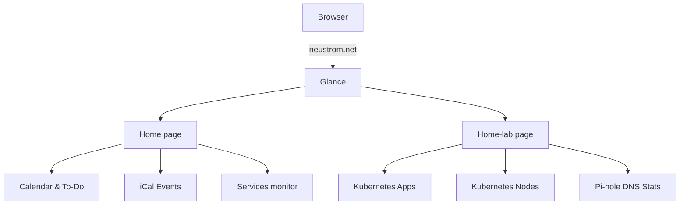

# Glance

Glance is the front door to the home lab — a dashboard that appears when
you open [neustrom.net](https://neustrom.net) in your browser. It brings
together live information from the cluster, your calendar, and your
bookmarks into a single page.

## Why it exists

Without a dashboard, navigating the home lab means remembering URLs. Glance
gives everything a visual home: one page to check what's running, what's
coming up in your calendar, and whether anything needs attention.

## What it shows

The dashboard has two pages, accessible from the nav tabs at the top.

### Home page

| Column | Widgets |
| --- | --- |
| Left (small) | Monthly calendar, to-do list |
| Centre (full) | Upcoming calendar events (from iCal feed) |
| Right (small) | Services monitor — live up/down status for all apps |

### Home-lab page

| Column | Widgets |
| --- | --- |
| Centre (full) | Live Kubernetes app list (all non-system namespaces) |
| Right (small) | Kubernetes node stats, Pi-hole DNS statistics |

### Calendar events

Calendar events are fetched from your personal ICS feed (e.g. Google
Calendar). The feed URL is stored as a sealed secret and injected at
runtime — it never appears in the repository. Ongoing events are
always shown first; upcoming events collapse after the first three.

### Kubernetes apps & nodes

The Kubernetes widgets are powered by
[glance-k8s](https://github.com/lukasdietrich/glance-k8s), a small
sidecar service that reads live data from the cluster API. It shows
every Deployment, StatefulSet, and DaemonSet across all non-system
namespaces, along with node resource usage.

Workloads can be given custom display names, icons, and links by adding
annotations — see the [Glance Configuration](../guides/glance.md) guide.

!!! info "To-do items are stored in your browser"
    The to-do list is saved in your browser's local storage, not on the server.
    This means items survive restarts of the dashboard, but the list is
    private to each browser — your phone and laptop will each have their own
    separate list, and clearing your browser data will wipe it.

### Pi-hole DNS stats

Glance connects directly to the Pi-hole API inside the cluster and shows
a summary of DNS queries: total queries, blocked percentage, and the top
blocked domains.

## Key details

| Key | Value |
| --- | --- |
| Namespace | `glance` |
| URL | [neustrom.net](https://neustrom.net) |
| Image | `glanceapp/glance:v0.8.4` |
| Config | ConfigMap `glance-config` (file: `config/glance.yml`) |
| Secrets | `glance-secrets` (SealedSecret — `ICS_URL`, `PIHOLE_TOKEN`) |
| iCal sidecar | `ghcr.io/awildleon/glance-ical-events:latest` on port 8076 |
| glance-k8s | `ghcr.io/lukasdietrich/glance-k8s/glance-k8s:v0.4.7` — service `glance-k8s` |
