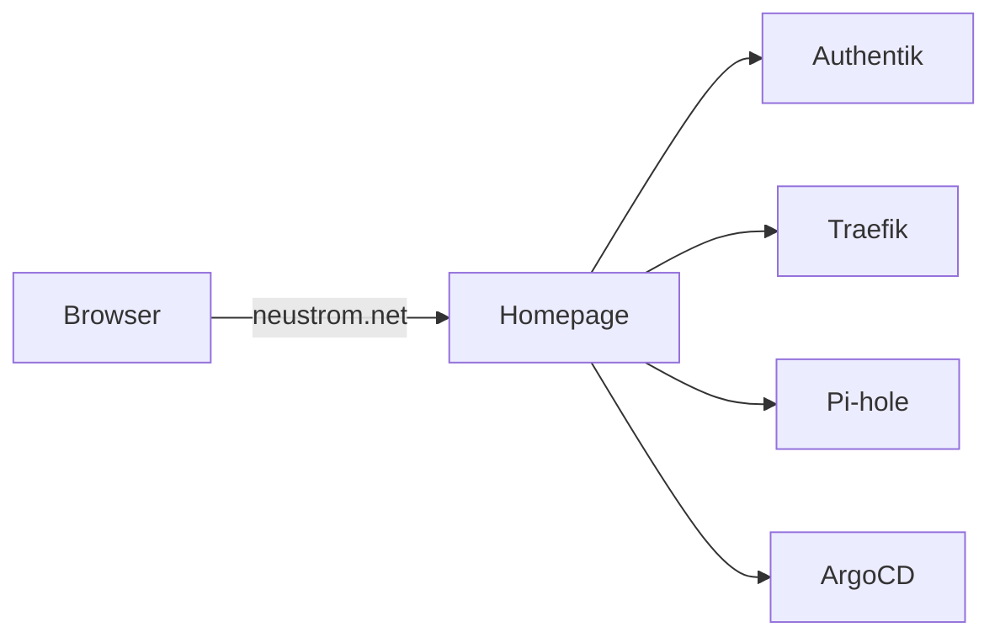

# Homepage

Homepage is the front door to the home lab — a dashboard that appears when
you open [neustrom.net](https://neustrom.net) in your browser. It shows all
the running services as clickable cards, and displays live cluster stats like
CPU and memory usage.

## Why it exists

Without a dashboard, knowing what's available in the home lab means
remembering URLs by heart. Homepage gives everything a single, visual index
so you can navigate to any service in one click.

## What it shows

The dashboard is divided into groups of service cards. Each card links to
one of the running applications:

At the top of the page there are **widgets** — small live indicators that
show the overall health of the cluster (how many nodes are running, how much
CPU and memory is in use).

## Configuration

Everything on the dashboard — the service cards, widgets, layout, and theme
— is defined in a Kubernetes ConfigMap stored in the repository at
`applications/vendor/homepage/configmap.yaml`. Editing that file and
pushing to `main` is all that's needed to update the dashboard; ArgoCD
will apply the change automatically.

The key config sections are:

| File | Controls |
| --- | --- |
| `settings.yaml` | Title, theme (dark/light), color scheme, layout |
| `services.yaml` | Service cards — name, URL, icon, description |
| `widgets.yaml` | Top-of-page info widgets (cluster stats, search) |
| `bookmarks.yaml` | Quick-access link groups |
| `kubernetes.yaml` | Kubernetes integration mode (`cluster` = read live data) |

## Key details

| Key | Value |
| --- | --- |
| Namespace | `homepage` |
| URL | [neustrom.net](https://neustrom.net) |
| Image | `ghcr.io/gethomepage/homepage` |
| Config | ConfigMap `homepage` in `homepage` namespace |
