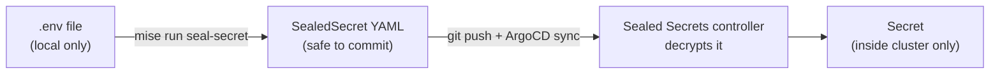

# Sealed Secrets

*Primary audience: Persona 2*

## What is it?

Sealed Secrets solves a specific problem: how do you store passwords and API keys in Git without exposing them?

Normally, you can't — putting a password in a Git repository (especially a public one) means anyone can read it. Sealed Secrets gets around this by **encrypting** secrets before they go into Git. The encrypted version (called a SealedSecret) looks like random gibberish to anyone who reads it. Only the controller running inside the cluster can decrypt it, using a private key that never leaves the cluster.

Think of it like a locked mailbox. Anyone can drop a letter in (encrypt a secret), but only the owner with the key can open it (the cluster controller).

## Why is it here?

This home lab uses GitOps — everything is in Git. That includes secrets like the Cloudflare API token needed for TLS certificates. Without Sealed Secrets, those tokens would either be stored in plaintext (unsafe) or kept outside Git entirely (breaks the "everything in Git" principle).

Sealed Secrets lets secrets live in Git safely.

## How does it work?

The cluster holds a key pair (public + private). The public key is stored in `certs/cert.pem` in this repository — it's safe to commit because it can only *encrypt*, not decrypt.

When you need to add a new secret:

1. Create a `.env` file locally with your secret values (never committed)
2. Run `mise run seal-secret` — this encrypts the values using the public key
3. The resulting `*-sealedsecret.yaml` file is safe to commit
4. When ArgoCD syncs it, the Sealed Secrets controller decrypts it and creates a regular Kubernetes secret inside the cluster

## On cluster re-install

The private key is generated fresh on every cluster install. This means sealed secrets from a previous cluster **cannot** be decrypted by a new one. After re-installing:

1. Run `mise run fetch-cert` to get the new cluster's public key
2. Re-seal all secrets with `mise run seal-secret`
3. Push and let ArgoCD sync
