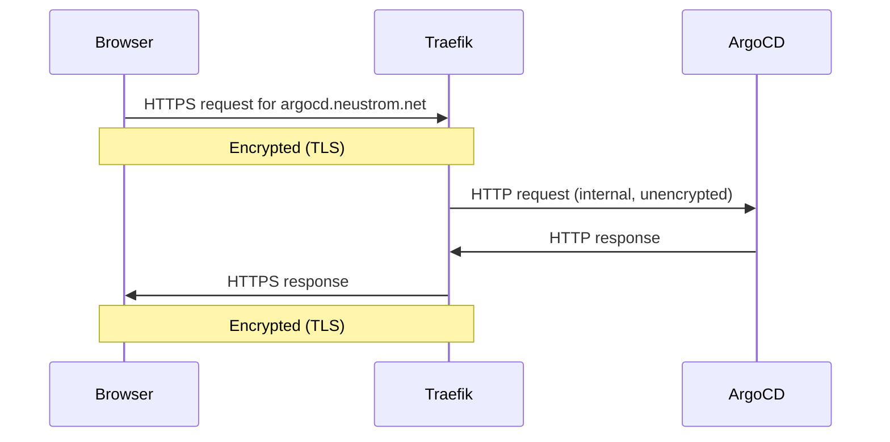

# Certificates & HTTPS

## The padlock in your browser

When you visit a website and see a padlock icon in the address bar, it means the connection is encrypted. Nobody between you and the server — not your internet provider, not someone on the same Wi-Fi — can read what you're sending or receiving. This is HTTPS (HTTP Secure).

Without it, everything travels in plain text. Your password, your session token, everything. With it, the data is scrambled in a way that only your browser and the server can unscramble.

## But how does your browser know it's talking to the *right* server?

Encryption alone isn't enough. If someone intercepts your connection and pretends to be the website, they could encrypt your data with *their* key and read it all. This is called a man-in-the-middle attack.

This is where **certificates** come in.

Think of a certificate like a **passport**. A passport proves your identity — and crucially, it was issued by a government that your bank, hotel, or border control already trusts. You didn't make the passport yourself; a trusted authority issued it after verifying who you are.

An HTTPS certificate works the same way:

- The server presents a certificate that says "I am `argocd.neustrom.net`"
- The certificate was issued and signed by a **Certificate Authority (CA)** — a trusted third party
- Your browser already has a list of CAs it trusts (built into the browser and your operating system)
- If the certificate checks out, the browser shows the padlock

If someone intercepts the connection and pretends to be the server, they can't forge a certificate from a trusted CA — they don't have the CA's private key.

## Certificate Authorities and Let's Encrypt

Historically, getting a certificate cost money and involved bureaucratic processes. In 2015, the **Let's Encrypt** project changed this by becoming a free, automated CA. Today, most of the web uses Let's Encrypt certificates.

To get a certificate from Let's Encrypt, you need to prove that you actually control the domain you're requesting a certificate for. Let's Encrypt offers a few ways to do this; this home lab uses the **DNS-01 challenge**:

1. Let's Encrypt says: "Add this specific text value to your domain's DNS records"
2. Your server (via Cloudflare's API) adds that record automatically
3. Let's Encrypt checks that the record exists — if it does, you clearly control the domain
4. Let's Encrypt issues the certificate
5. The temporary DNS record is deleted

This all happens automatically behind the scenes, without any manual steps.

## What is cert-manager?

In this home lab, the software that handles all of the above automatically is **cert-manager**. It runs inside the cluster and:

- Watches for `Certificate` resources you define in Git
- Triggers the DNS-01 challenge via the Cloudflare API
- Receives the issued certificate from Let's Encrypt
- Stores the certificate as a Kubernetes `Secret` (a secure key-value store inside the cluster)
- Automatically renews the certificate ~30 days before it expires

You declare *what* you want (a certificate for `*.neustrom.net`) and cert-manager handles *how* to get it.

## Wildcard certificates

Instead of getting a separate certificate for every subdomain (`argocd.neustrom.net`, `grafana.neustrom.net`, etc.), this home lab uses a single **wildcard certificate** for `*.neustrom.net`.

The `*` means "any subdomain". One certificate covers all services, forever — no matter how many new services you add.

## Where does Traefik fit in?

**Traefik** is the reverse proxy (or ingress controller) — the gatekeeper that receives all incoming web traffic and routes it to the right service.

Think of it like a hotel reception desk. Guests arrive and say "I'm here for room 412" — the receptionist directs them to the right floor. Traefik receives requests for `argocd.neustrom.net` and sends them to the ArgoCD service.

Traefik also handles the TLS encryption itself. The certificate (issued by cert-manager and stored in a Kubernetes Secret) is given to Traefik, which uses it to encrypt and decrypt all HTTPS traffic. Individual services like ArgoCD don't need to know anything about certificates — Traefik handles it all at the front door.

This setup is called **TLS termination at the ingress layer**.



## The /etc/hosts trick

Normally, when you type `argocd.neustrom.net` in your browser, it asks a DNS server on the internet to translate that name into an IP address. For this home lab, the cluster runs locally — the IP is `127.0.0.1` (your own machine), not something on the public internet.

Rather than setting up a full DNS server for local access, you can tell your computer to skip the DNS lookup for specific names by editing `/etc/hosts`. This file is checked first, before any DNS query is made.

Adding the line:

```
127.0.0.1  argocd.neustrom.net
```

tells your computer: "whenever anyone asks for `argocd.neustrom.net`, just use `127.0.0.1`". The request goes straight to the local cluster, and because the real Let's Encrypt certificate covers `*.neustrom.net`, the padlock still appears — the browser has no idea the domain doesn't actually resolve publicly.

!!! note
    This only affects the machine where the edit is made. Other devices on your network won't be able to reach the service unless they have the same entry, or you set up a real DNS record in Cloudflare.
