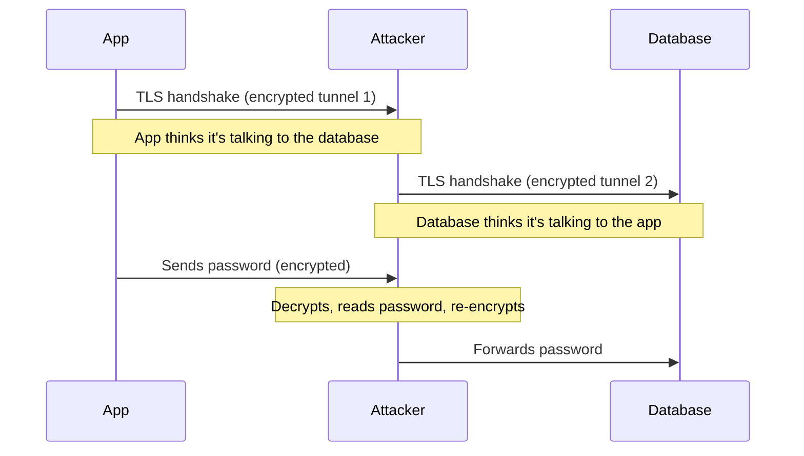
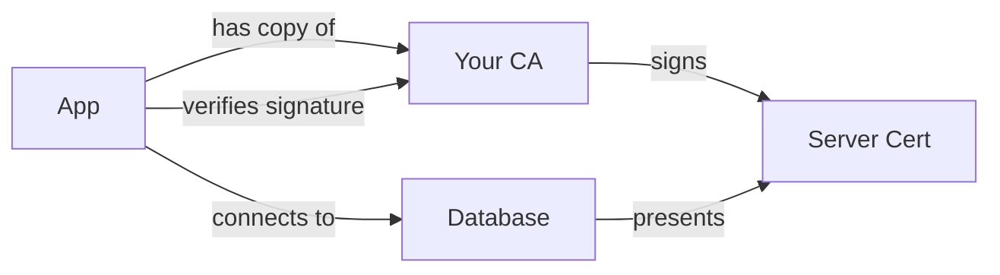
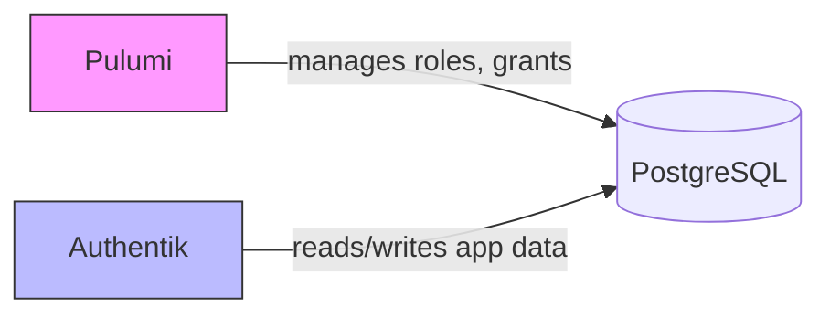

# Database Connection Security

## What happens when an app connects to a database?

When an application (like Authentik) connects to PostgreSQL, it opens a
network connection — similar to how your browser connects to a website.
The application sends a username and password, and if they're correct,
PostgreSQL lets it in.

By default, this entire conversation — including the password — happens
in plain text. Anyone who can see the network traffic can read
everything. On a home network this might seem harmless, but if the
database moves to a different machine (or a different network), it
becomes a real concern.

This is where **SSL/TLS** comes in — the same encryption technology that
gives you the padlock in your browser.

## The four levels of protection

PostgreSQL clients can be configured with different **SSL modes**, each
offering a different trade-off between convenience and security. Think
of them as increasingly strict bouncers at a door.

### `disable` — No encryption at all

Everything is sent in plain text. If someone on the network is
listening, they can read the password, the queries, and the data.

This is fine when the database is on the same machine as the
application (like a Docker container on `localhost`) because the traffic
never leaves the machine — there's no network to eavesdrop on.

### `require` — Encrypted, but trusting

The connection is encrypted, so eavesdroppers see scrambled data. But
the client doesn't check *who* it's talking to. It's like making a phone
call on a secure line without verifying who picked up.

This protects against **passive attacks** (someone silently recording
traffic). But it doesn't protect against an **active attacker** who
inserts themselves between the application and the database — a
man-in-the-middle (MITM).

How a MITM works with `require`:

Both connections are individually encrypted, but the attacker sits in
the middle with access to everything. The app has no way to know this is
happening because it never checked the server's identity.

In practice, pulling this off on a home network requires tricks like ARP
spoofing or DNS poisoning — possible, but a very targeted attack.

### `verify-ca` — Encrypted and verified

Same encryption as `require`, but now the client checks the server's
**certificate** — just like your browser checks a website's certificate
(see [Certificates & HTTPS](certificates-https.md)).

The setup:

1. You create your own **Certificate Authority (CA)** — a trusted
   "stamp of approval"
2. You sign the database server's certificate with that CA
3. Each client gets a copy of the CA certificate (not the server's
   private key — just the CA's public certificate)

When the app connects, it checks: "Was this server's certificate signed
by my trusted CA?" If an attacker tries to insert themselves with a fake
certificate, the check fails and the connection is refused.

This is the sweet spot for most setups where the database is on a
different machine.

### `verify-full` — Encrypted, verified, and name-checked

Everything `verify-ca` does, plus the client also checks that the
certificate's **hostname matches** the server it's connecting to.

Without this, if you have two databases signed by the same CA (say
`db-prod` and `db-staging`), a MITM could redirect traffic from one to
the other and the client wouldn't notice — both certificates are valid.

With `verify-full`, the client says: "I expected to connect to
`db-prod`, and the certificate says `db-staging` — rejected."

### Bonus: mTLS — both sides verify

All the modes above only verify the server's identity — the client
proves itself with a username and password *after* the encrypted
connection is established.

With **mutual TLS (mTLS)**, both sides present certificates. The server
also checks the client's certificate before allowing the connection.
A client without a valid certificate is rejected immediately at the
connection level — before any username or password is even sent.

This adds a second layer of authentication but requires managing
certificates for every client, which is rarely worth the complexity for
a home lab.

## Summary

| Mode | Encryption | Server identity | Hostname check | Protects against |
| --- | --- | --- | --- | --- |
| `disable` | No | No | No | Nothing |
| `require` | Yes | No | No | Passive eavesdropping |
| `verify-ca` | Yes | Yes | No | Eavesdropping + MITM |
| `verify-full` | Yes | Yes | Yes | Eavesdropping + MITM + server impersonation |
| mTLS | Yes | Yes (both) | Yes | All of the above + unauthorized clients |

## What this home lab uses

There are two separate connections to the database, and each has its own
SSL configuration:

**1. Pulumi → PostgreSQL** (management connection)

Pulumi connects to PostgreSQL during `pulumi up` to create and manage
roles, databases, and grants. This is a short-lived connection that only
runs on your local machine when you deploy infrastructure changes. The
SSL mode is configured in the Pulumi code (`sslmode` parameter on
`PostgresqlConfig`).

**2. Workloads → PostgreSQL** (application connections)

Applications like Authentik connect to PostgreSQL continuously to
read and write their data. They reach the database through a Kubernetes
service address (`postgres.databases.svc.cluster.local`). Each
application configures its own SSL mode independently — typically via
environment variables or config files in the application's Helm values.

**Current state:** both connections use `disable` because PostgreSQL
runs as a Docker container on the same machine. All traffic stays on
`localhost` — there is no network to eavesdrop on.

**When PostgreSQL moves off-host** (e.g. to a Proxmox LXC), both
connections would need updating:

- Pulumi: remove the `sslmode="disable"` override (the code defaults
  to `require`)
- Workloads: update each application's connection config to use
  `sslmode=require` (e.g. in Authentik's `config.properties`)
- PostgreSQL itself: enable SSL on the server with a certificate and
  key
