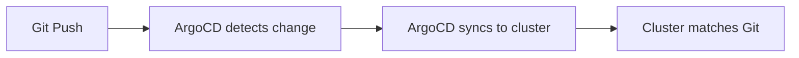

# GitOps

GitOps is an operational model where the desired state of your infrastructure
and applications is declared in a Git repository. A controller (ArgoCD in our
case) continuously reconciles the cluster state to match what is in Git.

## Principles

- **Git as the single source of truth** — all changes go through Git
- **Declarative configuration** — desired state is described, not scripted
- **Automated reconciliation** — ArgoCD detects drift and syncs automatically
- **Audit trail** — Git history provides a full log of what changed and why

## How It Works in This Repo

1. You commit a change to this repository
2. ArgoCD polls the repo (or receives a webhook) and detects the change
3. ArgoCD applies the updated manifests to the cluster
4. The cluster converges to the desired state
