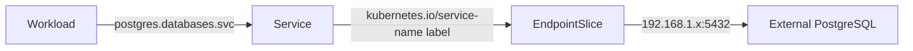

# Bootstrap

Bootstrapping is the process of getting the cluster from bare k3s to a
fully GitOps-managed state. Three things need manual bootstrapping:

1. **ArgoCD** — cannot deploy itself (chicken-and-egg problem)
2. **Vendor Apps (App of Apps)** — the root Application that tells ArgoCD to scan for vendor apps
3. **Infrastructure (Pulumi)** — external services (e.g. PostgreSQL) that live outside the cluster
4. **Database Endpoint** — a K8s Service + EndpointSlice pointing workloads to the external database

After these are applied, everything else is managed by ArgoCD via Git.

## Step 1: Deploy ArgoCD

```bash
kustomize build applications/bootstrap/argocd/ --enable-helm \
  | kubectl apply --server-side --force-conflicts -f -
```

!!! note "Why `--server-side --force-conflicts`?"
    The ArgoCD CRDs exceed the 262KB annotation limit imposed by client-side
    `kubectl apply`. Server-side apply avoids this limitation by not storing
    the `last-applied-configuration` annotation.

Verify ArgoCD is running:

```bash
kubectl get pods -n argocd
```

### Getting the Admin Password

```bash
kubectl -n argocd get secret argocd-initial-admin-secret \
  -o jsonpath='{.data.password}' | base64 -d
```

The ArgoCD UI is available at [https://argocd.home-lab.local](https://argocd.home-lab.local)
(requires DNS — see [DNS & Ingress](dns-ingress.md)).

## Step 2: Apply the App of Apps

```bash
kubectl apply -f applications/vendor/vendor-apps.yaml
```

This creates a root ArgoCD Application that recursively scans
`applications/vendor/` for `**/application.yaml` files. Each vendor app
is automatically discovered and deployed.

## Step 3: Deploy Infrastructure with Pulumi

External services (like PostgreSQL) are managed by Pulumi in the
`infrastructure/` directory. State is stored locally.

```bash
cd infrastructure

# One-time setup
pulumi login --local
pulumi stack init dev
pulumi config set --secret postgres:password <your-password>

# Deploy
pulumi up
```

This starts a PostgreSQL 18 container via Docker, accessible on port 5432
of the host machine.

!!! note "Data persists across `pulumi destroy`"
    The Docker volume uses `retain_on_delete=True`, so `pulumi destroy`
    removes the container and network but **keeps the volume and its data**.
    The next `pulumi up` reattaches to the existing volume. To permanently
    delete the data, run `docker volume rm postgres-data` manually.

## Step 4: Apply the Database Endpoint

The cluster needs a Service + EndpointSlice so workloads can reach the
external PostgreSQL instance at a stable in-cluster address
(`postgres.databases.svc.cluster.local`).

```bash
kubectl apply -k applications/bootstrap/postgres/
```

!!! warning "Verify the endpoint IP"
    The EndpointSlice in `applications/bootstrap/postgres/endpointslice.yaml`
    must point to the host running PostgreSQL. Update the IP if it has
    changed (e.g. new DHCP lease, migrating to Proxmox LXC).

!!! tip "Use the host's LAN IP, not `127.0.0.1`"
    From inside a pod, `127.0.0.1` refers to the pod itself — not the
    host machine. Use your host's LAN IP instead (find it with
    `ip -4 addr show | grep 'inet ' | grep -v 127.0.0.1`). Ignore
    `172.x` (Docker bridges) and `10.42.x` (flannel/CNI) addresses — use
    the one on your physical interface (e.g. `eth0`, `wlan0`). Consider
    setting a static DHCP lease on your router so the IP doesn't change.

Workloads connect using:

| Key | Value |
| --- | --- |
| Host | `postgres.databases.svc.cluster.local` |
| Port | `5432` |
| Namespace | `databases` |

### How This Works

Normally a Kubernetes Service has a `selector` that matches Pod labels.
Kubernetes then automatically creates EndpointSlice objects that list the
IPs of matching Pods, and kube-proxy routes Service traffic to those Pods.

When a Service is created **without a selector**, Kubernetes skips the
automatic endpoint discovery entirely — it creates the Service (and its
cluster DNS entry) but has nowhere to route traffic. You fill that gap by
creating an EndpointSlice manually and linking it to the Service with the
label `kubernetes.io/service-name: <service-name>`.

The result is identical from the consumer's perspective:
`postgres.databases.svc.cluster.local` resolves via cluster DNS, and
kube-proxy routes traffic to whatever IPs are listed in the EndpointSlice.
Workloads never know or care that the target is external.

This gives a single point of change: when PostgreSQL moves (e.g. from
local Docker to a Proxmox LXC), only the IP in `endpointslice.yaml`
needs updating — no application configs, secrets, or connection strings
change.



## What Gets Deployed

### ArgoCD Bootstrap (`applications/bootstrap/argocd/`)

- ArgoCD Helm chart (version defined in `kustomization.yaml`)
- The `argocd` namespace
- A Traefik Ingress for `argocd.home-lab.local`
- A Traefik Middleware that redirects HTTP to HTTPS
- Kustomize build options (`--enable-helm`) for ArgoCD's repo server

### PostgreSQL Endpoint (`applications/bootstrap/postgres/`)

- The `databases` namespace
- A headless Service (`postgres`) for in-cluster DNS
- An EndpointSlice pointing to the external PostgreSQL host

### Vendor Apps (via App of Apps)

- **Sealed Secrets** — encrypts secrets so they can be stored in Git
- **cert-manager** — automated TLS certificates via Let's Encrypt (Cloudflare DNS challenge)
