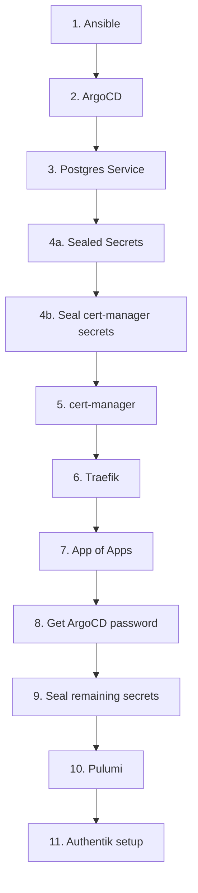
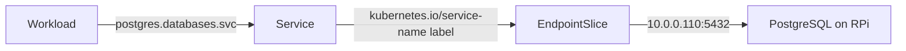

# Bootstrap

Bootstrapping gets the cluster from bare k3s to a fully GitOps-managed state.

Most apps are managed by ArgoCD via the App of Apps pattern, but several must
be applied manually in a specific order. Applying the App of Apps too early
causes apps that depend on certificates or secrets to fail.



## Step 1: Run Ansible

Ansible provisions the RPi — installs and configures PostgreSQL for remote
access, and deploys the k3s config. The cluster cannot start without this.

```bash
uv run ansible-playbook -i ansible/inventory.yaml ansible/playbook.yaml
```

See [Ansible](../guides/ansible.md) for first-time SSH setup and details on
what the playbook does.

## Step 2: Deploy ArgoCD

```bash
kustomize build applications/bootstrap/argocd/ --enable-helm \
  | kubectl apply --server-side --force-conflicts -f -
```

!!! note "Why `--server-side --force-conflicts`?"
    The ArgoCD CRDs exceed the 262KB annotation limit imposed by client-side
    `kubectl apply`. Server-side apply avoids this by not storing the
    `last-applied-configuration` annotation.

Verify pods are running:

```bash
kubectl get pods -n argocd
```

## Step 3: Deploy the Postgres Service

Creates the in-cluster Service + EndpointSlice so workloads can reach the
external PostgreSQL instance at `postgres.databases.svc.cluster.local`.

```bash
kubectl apply -k applications/bootstrap/postgres/
```

!!! warning "Verify the endpoint IP"
    `applications/bootstrap/postgres/endpointslice.yaml` must point to
    the host running PostgreSQL (`10.0.0.110`). Update the IP if it has
    changed (e.g. after reinstall or DHCP change).

## Step 4a: Deploy Sealed Secrets

Sealed Secrets must be running before cert-manager, Traefik, or Authentik —
those apps each depend on SealedSecrets that cannot be decrypted until the
controller is present.

Apply the ArgoCD Application directly (not via App of Apps yet):

```bash
kubectl apply -f applications/vendor/sealed-secrets/application.yaml
```

Wait for the controller to become ready:

```bash
kubectl get pods -n sealed-secrets
```

Then fetch the cluster's public cert, used to seal secrets locally:

```bash
mise run fetch-cert
```

!!! warning "Re-run after cluster reinstall"
    The cluster generates a new Sealed Secrets key on reinstall. Re-run
    `mise run fetch-cert` and re-seal all secrets before applying anything
    else.

## Step 4b: Seal cert-manager secrets

cert-manager needs a Cloudflare API token to perform DNS-01 challenges for
Let's Encrypt. The SealedSecret is committed at
`applications/vendor/cert-manager/cloudflare-api-token-sealedsecret.yaml`,
but must be re-sealed if the cluster was reinstalled.

Create a `.env` file:

```bash
CLOUDFLARE_API_TOKEN=<your-token>
```

Seal it:

```bash
mise run seal-secret
```

Move the generated file to `applications/vendor/cert-manager/` and commit.

## Step 5: Deploy cert-manager

cert-manager issues the wildcard TLS certificate (`*.neustrom.net`) that
Traefik uses. Traefik will not deploy correctly without it.

```bash
kubectl apply -f applications/vendor/cert-manager/application.yaml
```

Wait for cert-manager and the ClusterIssuer to become ready:

```bash
kubectl get pods -n cert-manager
kubectl get clusterissuer
```

## Step 6: Deploy Traefik

Traefik is the ingress controller. It must be running before other apps so
their HTTPRoutes can resolve.

```bash
kubectl apply -f applications/vendor/traefik/application.yaml
```

Verify:

```bash
kubectl get pods -n traefik
```

## Step 7: Apply the App of Apps

With the critical path running, apply the root Application that tells ArgoCD
to manage everything else:

```bash
kubectl apply -f applications/vendor/vendor-apps.yaml
```

ArgoCD recursively scans `applications/vendor/` for `**/application.yaml`
files and begins syncing each app automatically. This includes Authentik and
any other vendor apps.

## Step 8: Get the ArgoCD admin password

```bash
kubectl -n argocd get secret argocd-initial-admin-secret \
  -o jsonpath='{.data.password}' | base64 -d
```

Log in at `https://argocd.neustrom.net` and verify all apps are syncing.

## Step 9: Seal remaining secrets

Other apps (e.g. Authentik) need their own SealedSecrets. For each app:

1. Create a `.env` file with the required key/value pairs
2. Run `mise run seal-secret`
3. Move the generated file to the app directory and commit
4. ArgoCD picks it up on the next sync

## Step 10: Run Pulumi

Pulumi configures PostgreSQL on the RPi — roles, users, and service accounts.
The database itself is already running (provisioned by Ansible).

```bash
cd infrastructure
pulumi login --local
pulumi stack init prod
pulumi config set --secret postgres:password <postgres-superuser-password>
pulumi up
```

This creates:

- **Roles**: `readonly` (SELECT) and `readwrite` (full CRUD)
- **Human users**: `robert` (readwrite) and `anna` (readonly)
- **Service accounts**: one per app (e.g. `authentik`)

Passwords are auto-generated. Retrieve them with:

```bash
pulumi stack output --show-secrets authentik_password
```

## Step 11: Initial Authentik setup

Once Authentik pods are running:

1. Open `https://auth.neustrom.net/if/flow/initial-setup/`
2. Create the `akadmin` account and set a password
3. The admin interface is at `https://auth.neustrom.net/if/admin/`

!!! note "One-time only"
    The initial setup wizard disappears after the admin account is created.
    To reset it, delete the Authentik database and let the migrations re-run.

## Reference: what gets deployed

### ArgoCD Bootstrap (`applications/bootstrap/argocd/`)

- ArgoCD Helm chart
- The `argocd` namespace
- A Traefik HTTPRoute for `argocd.neustrom.net`

### PostgreSQL Endpoint (`applications/bootstrap/postgres/`)

- The `databases` namespace
- A ClusterIP Service (`postgres`) for in-cluster DNS
- An EndpointSlice pointing to the RPi at `10.0.0.110`

### How the Postgres Service works

A normal Kubernetes Service routes traffic to Pods via a selector. When
created **without** a selector, Kubernetes skips automatic endpoint discovery —
the Service exists (and gets a DNS entry) but has no routing target. An
EndpointSlice is created manually and linked to the Service via the
`kubernetes.io/service-name` label, pointing traffic at the external host.

From a workload's perspective this is invisible — `postgres.databases.svc.cluster.local`
resolves and routes exactly as if it were a normal in-cluster Service.

The benefit: when PostgreSQL moves, only the IP in `endpointslice.yaml`
changes — no application configs or connection strings need updating.



### Vendor Apps (via App of Apps)

- **Sealed Secrets** — decrypts SealedSecret resources in-cluster
- **cert-manager** — wildcard TLS via Let's Encrypt, Cloudflare DNS challenge
- **Traefik** — ingress controller with Gateway API support
- **Authentik** — identity provider, SSO, forward-auth
