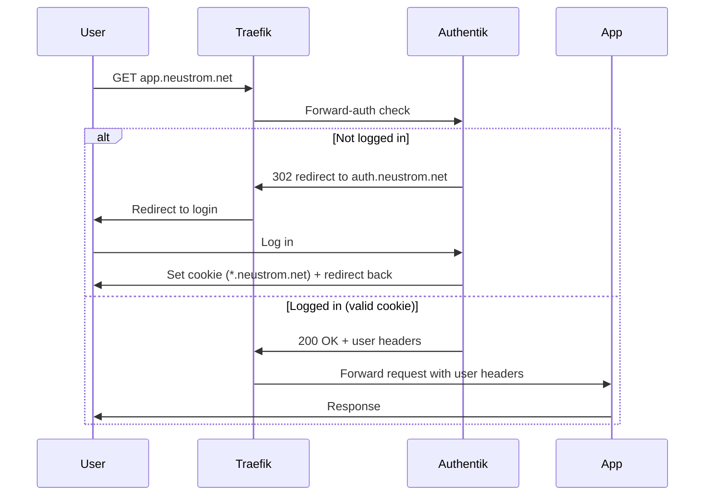

# Configuring Authentik Forward Auth

Authentik protects all `*.neustrom.net` applications using a single
**domain-level forward-auth** provider. This means one configuration
in Authentik covers every app — no per-app setup needed.

## How it works



The key is **domain-level** mode: Authentik sets an authentication
cookie on `neustrom.net`, so logging in once at any app means you're
logged in everywhere. No need to create a separate Authentik Application
for each service you deploy.

## One-time setup in Authentik admin

### 1. Create a Proxy Provider

1. Go to Applications > Providers > Create
2. Select **Proxy Provider**
3. Configure:

    | Field | Value |
    | --- | --- |
    | Name | `forward-auth-domain` |
    | Authorization flow | `default-provider-authorization-implicit-consent` |
    | Forward auth mode | **Forward auth (domain level)** |
    | Authentication URL | `https://auth.neustrom.net` |
    | Cookie domain | `neustrom.net` |

!!! note "Why implicit consent?"
    The `implicit-consent` flow skips the "Do you want to allow this
    application?" prompt. Since this is a home lab with trusted users,
    there's no reason to show a consent screen on every app.

### 2. Create an Application

1. Go to Applications > Applications > Create
2. Configure:

    | Field | Value |
    | --- | --- |
    | Name | `Forward Auth (Domain)` |
    | Slug | `forward-auth-domain` |
    | Provider | `forward-auth-domain` |

Access is controlled by policy bindings on this application. By default,
all authenticated users have access. To restrict access to specific
users or groups, add policy bindings here.

### 3. Verify the Outpost

1. Go to Applications > Outposts
2. Open the **authentik Embedded Outpost**
3. Confirm `Forward Auth (Domain)` is in the Selected Applications list
4. If not, add it and click Update

## Protecting an app

Add the forward-auth middleware to the app's route. The syntax depends
on which Traefik routing resource you're using:

### Gateway API HTTPRoute

Add an annotation:

```yaml
apiVersion: gateway.networking.k8s.io/v1
kind: HTTPRoute
metadata:
  name: my-app
  namespace: my-namespace
  annotations:
    traefik.io/middleware: authentik-authentik-forwardauth@kubernetescrd
spec:
  # ... rest of the route
```

The format is `<namespace>-<middleware-name>@kubernetescrd`, so
`authentik-authentik-forwardauth` means the Middleware resource named
`authentik-forwardauth` in the `authentik` namespace.

### Traefik IngressRoute CRD

Add a `middlewares` block to the route:

```yaml
apiVersion: traefik.io/v1alpha1
kind: IngressRoute
metadata:
  name: my-app
  namespace: my-namespace
spec:
  routes:
    - match: Host(`my-app.neustrom.net`)
      kind: Rule
      middlewares:
        - name: authentik-forwardauth
          namespace: authentik
      services:
        - name: my-service
          port: 80
```

No `@kubernetescrd` suffix needed — IngressRoute references the
Middleware resource directly by name and namespace.

---

That's it. No changes needed in Authentik — the domain-level provider
covers all `*.neustrom.net` subdomains automatically.

!!! warning "Don't protect auth.neustrom.net itself"
    Never add the forward-auth middleware to Authentik's own HTTPRoute.
    This would create a redirect loop — Authentik can't authenticate
    you if it can't serve the login page.

## Creating users

1. Go to Directory > Users > Create
2. Set username and email
3. Set a password (or send an enrollment invite)

Users can then log in at any protected app and will be redirected to
`auth.neustrom.net` to authenticate.

## User headers

When a request passes authentication, Authentik adds headers that
downstream apps can use:

| Header | Content |
| --- | --- |
| `X-authentik-username` | Username |
| `X-authentik-email` | Email address |
| `X-authentik-name` | Display name |
| `X-authentik-groups` | Group memberships |
| `X-authentik-uid` | Unique user ID |

Some apps (like those with built-in user management) can use these
headers to auto-create accounts or map permissions.

## Deployed resources

The forward-auth infrastructure is already deployed via GitOps:

| Resource | File | Purpose |
| --- | --- | --- |
| Middleware | `applications/vendor/authentik/middleware.yaml` | Traefik forward-auth config pointing to Authentik |
| HTTPRoute | `applications/vendor/authentik/httproute.yaml` | Routes `auth.neustrom.net` to Authentik |
| Helm chart | `applications/vendor/authentik/kustomization.yaml` | Authentik server + worker |

Only the Authentik admin UI configuration (provider, application,
outpost) needs to be done manually.
