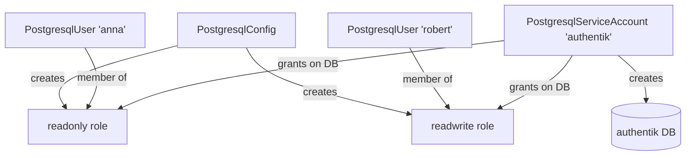

# Database Management

PostgreSQL databases, roles, and users are managed as code via Pulumi in
the `postgresql_config` package. This uses the
[Pulumi PostgreSQL provider](https://www.pulumi.com/registry/packages/postgresql/)
to connect to the running PostgreSQL instance and manage objects inside
it.

## Architecture



## Components

### PostgresqlConfig

Creates the PostgreSQL provider and two shared roles:

- **`readonly`** — `CONNECT` on databases, `USAGE` on schemas, `SELECT`
  on tables and sequences
- **`readwrite`** — everything readonly has, plus `INSERT`, `UPDATE`,
  `DELETE` on tables, `UPDATE` on sequences, and `CREATE` on schemas

### PostgresqlUser

A human user with:

- A login role
- Auto-generated 32-character password
- Membership in `readonly` or `readwrite`

### PostgresqlServiceAccount

An application user with:

- A login role
- Auto-generated 32-character password
- A dedicated database (same name as the account), owned by the user
- Grants for both `readonly` and `readwrite` roles on that database
- Default privileges so future tables/sequences created by the owner
  are automatically accessible to both roles

## Common tasks

### Add a new application database

In `infrastructure/__main__.py`, add the name to the service accounts
list:

```python
service_accounts = [
    PostgresqlServiceAccount(name, pg_config=pg_config)
    for name in ["authentik", "newapp"]
]
```

Then deploy:

```bash
cd infrastructure
pulumi up
```

This creates the `newapp` user, `newapp` database, and all grants in one
step.

### Add a new human user

```python
human_users = [
    PostgresqlUser("robert", role="readwrite", pg_config=pg_config),
    PostgresqlUser("anna", role="readonly", pg_config=pg_config),
    PostgresqlUser("newuser", role="readonly", pg_config=pg_config),
]
```

### Retrieve a password

```bash
pulumi stack output --show-secrets <name>_password
```

### Use a service account password in a SealedSecret

1. Get the password:

    ```bash
    pulumi stack output --show-secrets authentik_password
    ```

2. Create a `.env` file with the password (plus any other secrets)

3. Seal it:

    ```bash
    mise run seal-secret
    ```

## How grants work

Each service account database gets two layers of grants:

1. **Direct grants** — `CONNECT` on the database, `USAGE`/`CREATE` on
   the `public` schema. These apply immediately.

2. **Default privileges** — scoped to the service account as owner. Any
   table or sequence the service account creates in the future
   automatically gets the correct permissions for both roles.

!!! warning "Owner matters"
    Default privileges only fire for objects created by the specified
    owner. If you manually create a table as the `postgres` superuser,
    the readonly/readwrite roles will not have access to it unless you
    grant it explicitly.

## Implementation details

- Grants are chained sequentially via `depends_on` to avoid PostgreSQL
  catalog concurrency errors (`tuple concurrently updated`).
- The `PostgresqlConfig` component depends on the `Postgres` container
  component, and the container uses `wait=True` + `wait_timeout=30` to
  ensure PostgreSQL is accepting connections before any SQL runs.
