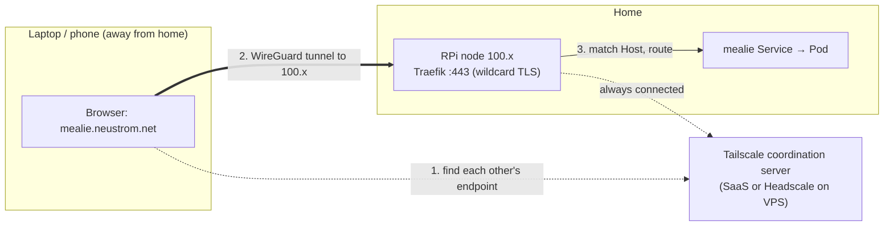

# Remote Access with Tailscale

How to reach cluster services (`*.neustrom.net`) from anywhere — no static IP, no port forwarding,
no changes to the cluster.

## The problem

The home connection has **no static IP** and is likely behind **CGNAT** (the ISP shares one public IP
across many customers). That kills the classic remote-access recipes:

- A public DNS A record → home IP breaks every time the IP changes.
- Port forwarding requires an inbound-reachable public IP, which CGNAT does not give you.
- A self-hosted VPN (WireGuard) needs an inbound port — same CGNAT wall.

Everything above needs the home to be *reachable from outside*. It is not. So the solution has to work
**outbound-only**.

## Big picture

Tailscale builds a private encrypted mesh (a *tailnet*) between your devices. Every device gets a stable
private IP in the `100.64.0.0/10` range that follows it regardless of which network it is on. The RPi node
joins the tailnet; your laptop and phone join the same tailnet; they reach the node by its `100.x` address
over an encrypted WireGuard tunnel.

Crucially, **Traefik does not change**. Tailscale is just a second door into the same Traefik that already
serves the LAN. Requests arriving over the tailnet hit the node's `100.x` IP, land on Traefik's `:443`,
and are routed by `Host` header exactly like LAN requests. DNS decides which door a request takes.



## Why no cluster changes are needed

This is the key property to test. Enabling remote access touches **zero Kubernetes manifests**:

- **Node level** — install the `tailscale` daemon on the RPi. Not a k8s resource.
- **Client level** — install Tailscale on laptop/phone.
- **DNS** — one record so `*.neustrom.net` resolves to the node's `100.x` when away.

Everything already in the cluster keeps working because:

- **Traefik binds all node IPs.** The k3s ServiceLB (klipper) binds node ports `80`/`443` on every
  interface, so the tailnet `100.x` address is served automatically — no extra listener.
- **Routing is by `Host`.** An existing `HTTPRoute`/`Ingress` matches on hostname, not on which IP the
  request arrived through. The same route serves LAN and tailnet traffic.
- **The cert is valid everywhere.** cert-manager issues the wildcard `*.neustrom.net` via a Cloudflare
  **DNS-01** challenge. DNS-01 never needs the domain to point at a reachable IP, so TLS stays valid no
  matter where the request comes from.

## How Tailscale works (the parts that matter here)

Tailscale splits into two planes:

- **Control plane (coordination server)** — a phonebook and matchmaker. It handles device registration,
  key exchange, and telling each node the *current* network endpoint of its peers. It **carries no
  traffic**. This is Tailscale's SaaS by default, or a self-hosted **Headscale** instance.
- **Data plane** — the actual packets travel **peer-to-peer over WireGuard**, directly between devices.
  The coordination server never sees them.

Three facts follow that make this work at home:

- **CGNAT and no static IP are fine.** When two devices are both behind NAT and neither can accept inbound
  connections, they meet on a **DERP relay** — both connect *outbound* to the relay and rendezvous there,
  then try to upgrade to a direct connection via NAT hole-punching. Nothing at home needs to be
  inbound-reachable.
- **Changing IPs are the normal case.** Turn a phone off for days; the ISP IP changes. On reconnect the
  phone re-contacts the coordination server, reports its new endpoint, and learns the node's current
  endpoint. **Node keys persist on the device**, so there is never any re-pairing. This is the expected
  flow, not an edge case.
- **The coordination server is the one thing that must be publicly reachable.** It is the fixed address
  everyone dials. It therefore **cannot live at home** (no static IP). Either depend on Tailscale's SaaS,
  or host Headscale on a box that *does* have a public IP (see [Alternatives](#alternatives)).

## Setup

### 1. RPi node

Install Tailscale and bring the node onto the tailnet:

```bash
curl -fsSL https://tailscale.com/install.sh | sh
sudo tailscale up
```

Note the node's tailnet IP for the DNS step:

```bash
tailscale ip -4
```

The node only needs to be reachable *as itself* (it hosts Traefik). No subnet router or
`--advertise-routes` is required for this setup.

### 2. Client devices

Install Tailscale on each laptop and phone and log in to the **same tailnet**. Once connected, the client
can reach the node's `100.x` IP directly.

### 3. DNS

Two locations, two resolution paths for `*.neustrom.net`:

| Location | Resolver | `*.neustrom.net` resolves to | Path |
| --- | --- | --- | --- |
| At home (LAN) | PiHole (see [Per-Network DNS](per-network-dns.md)) | node LAN IP `10.0.0.110` | direct LAN, no tailnet hop |
| Away | public DNS or Tailscale MagicDNS | node tailnet IP `100.x` | WireGuard tunnel to node |

For the *away* case, the simplest option is a **public** Cloudflare wildcard record holding the private
tailnet IP:

```text
*.neustrom.net   A   100.x.y.z   (the node's tailnet IP)
```

A public DNS record may hold a private IP — this is common and safe:

- On the tailnet → resolves `100.x` → tunnel reaches the node.
- Off the tailnet → resolves `100.x` → routes nowhere → fails closed (private by default).

At home, PiHole overrides this with the LAN IP so traffic stays on the LAN instead of taking a tailnet
hop. The existing [Per-Network DNS](per-network-dns.md) setup already makes home devices use PiHole.

!!! note "Changing the existing public A record is safe"
    If `*.neustrom.net` currently points at a (non-functional) home public IP, repointing it to the
    tailnet IP does **not** affect certificate issuance — cert-manager uses DNS-01 (TXT records) and
    never reads the A record.

!!! tip "MagicDNS alternative"
    Instead of a public record, Tailscale's MagicDNS split-DNS can resolve `neustrom.net` to the tailnet
    IP for tailnet members only, keeping the private IP out of public DNS. More config; use it when hiding
    the `100.x` address matters.

## Verify

Test the full remote path from a device **not on the home LAN** (e.g. phone on cellular, tethering the
laptop):

```bash
tailscale status                 # node shows as a peer, connection is direct or via DERP
ping 100.x.y.z                   # node's tailnet IP responds
curl -I https://mealie.neustrom.net   # 200/redirect, valid TLS, no cert warning
```

A valid certificate with no warning confirms Traefik terminated TLS with the wildcard cert over the
tailnet — the whole path works end to end.

## Running work and personal tailnets together

A single `tailscaled` daemon is bound to **one tailnet at a time**. With a work Headscale tailnet and a
personal Tailscale tailnet, the default answer is **profiles**, not simultaneous connections:

```bash
# Personal (Tailscale SaaS)
sudo tailscale up
tailscale set --nickname personal          # name the current profile

# Work (Headscale) — creates/uses a separate profile
sudo tailscale login --login-server https://headscale.example.com

# Switch between them (stored profiles, no re-authentication)
tailscale switch personal
tailscale switch work
```

Only one tailnet is active at a time; switching is instant and does not re-authenticate. Both tailnets
assign from the same `100.64.0.0/10` range and are otherwise independent networks — that address overlap
is exactly why one daemon cannot serve both at once.

!!! warning "Simultaneous connection is an advanced escape hatch"
    Being on both tailnets *at the same time* requires running a second `tailscaled` with its own socket,
    state directory, and `tun` interface (with `netfilter-mode off`), or network namespaces / a per-tailnet
    container. It makes you the referee between two daemons fighting over routing and DNS. A household
    rarely needs this — prefer profile switching.

## Alternatives

- **Cloudflare Tunnel** — for services that must be public *without* the visitor installing a client
  (sharing a recipe link with a friend). `cloudflared` dials Cloudflare's edge outbound, so it needs no
  static IP and no coordination server. Pair it with Authentik forward-auth. Its downside vs Tailscale is
  a public surface, and its free tier disallows streaming media (route baby-monitor video over Tailscale
  instead).
- **Headscale on a VPS** — to self-host the control plane and drop the dependency on Tailscale's SaaS. It
  must run where there is a public IP (a small ~$5/mo droplet), *not* at home. Run a DERP there too so
  relaying is also yours. Worth it only if avoiding the SaaS dependency is a firm requirement; a household
  is usually well served by the free tier.
