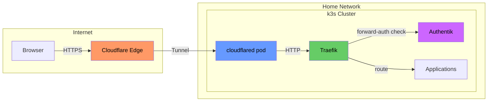
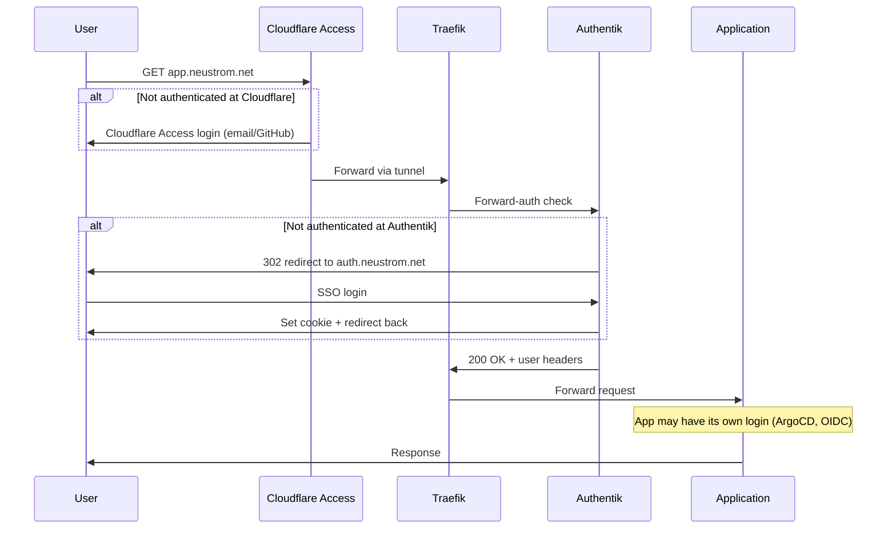
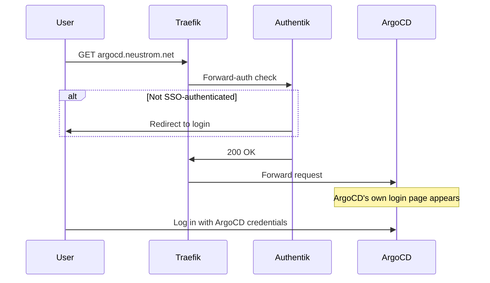

# Security Hardening for External Access

This guide documents the security review and hardening plan for exposing the home
lab to the internet via Cloudflare Tunnel. It covers every identified gap, the
rationale behind each fix, and the specific files to modify.

**Status:** Plan only -- not yet implemented.

---

## Why Cloudflare Tunnel (not DNS proxy)

There is no static IP from the ISP, which rules out traditional Cloudflare DNS
proxy (A record pointing to a public IP). Even if there were a static IP, Cloudflare
Tunnel is the better choice:

| | DNS Proxy (A record) | Cloudflare Tunnel |
| --- | --- | --- |
| Router ports | Must forward 80/443 | **None** -- outbound only |
| Home IP | Exposed in DNS records | **Hidden** -- CNAME to tunnel ID |
| Bypass risk | Attacker can hit IP directly, skip Cloudflare | **Cannot bypass** -- no open ports |
| Dynamic IP | Needs DDNS | **No problem** -- tunnel reconnects |
| Free tier | Yes | **Yes** |

`cloudflared` runs as a pod in the cluster and makes an **outbound-only**
connection to Cloudflare's edge network. Traffic can only reach internal services
through the tunnel. This eliminates an entire class of bypass attacks.



**Routing strategy:** Tunnel -> Traefik (single catch-all rule). This preserves all
existing IngressRoute configs, middlewares, and TLS handling. Cloudflare SSL mode
set to "Full" (Traefik terminates TLS internally).

---

## Authentication Strategy: Defense in Depth

Every externally-facing service gets up to three independent authentication layers:

| Layer | Where | What | Protects against |
| --- | --- | --- | --- |
| **Cloudflare Access** | Cloudflare edge | Zero Trust auth gate | Traefik/app zero-days, tunnel compromise |
| **Authentik forward-auth** | Traefik middleware | SSO cookie check | App-level auth bugs, unauthenticated access |
| **App-native auth** | Application | Built-in login (ArgoCD, OIDC) | Forward-auth bypass, session hijacking |

An attacker must compromise all layers to gain access. Even a zero-day in one
layer is blocked by the others.



### Per-service auth analysis

| Service | Host | Current auth | After hardening |
| --- | --- | --- | --- |
| **Glance** | `neustrom.net` | **None** | CF Access + forward-auth |
| **Cost-tracker** | `costs.neustrom.net` | OIDC only | CF Access + forward-auth + OIDC |
| **Authentik** | `auth.neustrom.net` | Own login | CF Access (exempt from forward-auth) |
| **ArgoCD** | `argocd.neustrom.net` | Own login only | CF Access + forward-auth + built-in login |
| **Traefik** | `traefik.neustrom.net` | Forward-auth | CF Access + forward-auth |
| **Pi-hole** | `pihole.neustrom.net` | Forward-auth | CF Access + forward-auth |

---

## Critical Fixes

These must be done before exposing the cluster externally. Each represents a
direct path to compromise if left unaddressed.

### 1. Deploy Cloudflare Tunnel

**Gap:** No mechanism to route external traffic to the cluster without opening
router ports.

**Fix:** Deploy `cloudflared` as a Kubernetes Deployment.

New files to create:

```text
applications/vendor/cloudflared/
├── application.yaml                          # ArgoCD Application
├── kustomization.yaml                        # Kustomize manifest
├── deployment.yaml                           # cloudflared pod
└── tunnel-credentials-sealedsecret.yaml      # Tunnel token (sealed)
```

The tunnel config maps all traffic to Traefik's internal service:

```yaml
# Tunnel ingress config (in ConfigMap or as args)
ingress:
  - service: http://traefik.traefik.svc.cluster.local
```

On the Cloudflare dashboard:

1. Create a tunnel in Zero Trust > Networks > Tunnels
2. Copy the tunnel token
3. Seal the token and commit as a SealedSecret
4. Change all `*.neustrom.net` DNS records from A records to CNAMEs
   pointing to `<tunnel-id>.cfargotunnel.com`

### 2. Fix kubeconfig permissions

**Gap:** `write-kubeconfig-mode: "644"` in `diet-pi/k3s-config.yaml` makes the
kubeconfig world-readable on the host.

**Why this matters:** Any process on the DietPi host -- even a low-privilege one
-- can read `/etc/rancher/k3s/k3s.yaml` and get full **cluster-admin** access.
This is the difference between a container escape giving "host-level access" vs
"host-level access + full cluster control over every pod, secret, and namespace."

**Fix:**

```yaml
# diet-pi/k3s-config.yaml
write-kubeconfig-mode: "600"  # was "644"
```

Then re-apply via Ansible and restart k3s.

### 3. Disable Traefik insecure API and close port 9000

**Gap:** Two settings in `applications/vendor/traefik/values.yaml`:

- `api.insecure: true` (line 50) -- exposes the Traefik dashboard/API without TLS
  or authentication on port 9000
- `ports.traefik.expose.default: true` (line 61) -- makes port 9000 accessible on
  the LoadBalancer service, not just cluster-internal

Together, these expose the **full Traefik API** to anyone on the network. The API
reveals:

- Complete routing table (every hostname -> service mapping)
- All middleware configurations (including auth endpoints)
- Internal service addresses and namespaces
- Certificate details

This is a reconnaissance goldmine for an attacker.

**Fix:**

```yaml
# applications/vendor/traefik/values.yaml
api:
  dashboard: true
  insecure: false  # was true

ports:
  traefik:
    port: 9000
    expose:
      default: false  # was true
```

The dashboard remains accessible through the authenticated IngressRoute at
`traefik.neustrom.net` (defined in `dashboard-ingressroute.yaml`, which already
has `authentik-forwardauth` middleware).

### 4. Add forward-auth to ArgoCD

**Gap:** `applications/bootstrap/argocd/ingress.yaml` uses a standard
`networking.k8s.io/v1` Ingress with no authentication middleware. ArgoCD relies
solely on its built-in login.

**Why this matters:** ArgoCD has **cluster-admin privileges**. It can deploy any
manifest to any namespace, read all secrets, and modify any resource. It is the
single most powerful tool in the cluster. Relying on one auth layer for the most
critical service is insufficient when internet-facing.

ArgoCD has had auth bypass CVEs in the past (e.g., CVE-2024-31990, CVE-2023-22482).
A single such vulnerability would give an attacker full cluster control.

**The recommendation is NOT to replace ArgoCD's login.** It is to add forward-auth
as a second layer in front:



An attacker must now bypass both Authentik SSO **and** ArgoCD's own auth.

**Fix:** Convert the Ingress to a Traefik IngressRoute with forward-auth. The
current Ingress:

```yaml
# applications/bootstrap/argocd/ingress.yaml (CURRENT)
apiVersion: networking.k8s.io/v1
kind: Ingress
metadata:
  name: argocd-server
  namespace: argocd
  annotations:
    traefik.ingress.kubernetes.io/router.entrypoints: websecure
spec:
  ingressClassName: traefik
  rules:
    - host: argocd.neustrom.net
      http:
        paths:
          - path: /
            pathType: Prefix
            backend:
              service:
                name: argocd-server
                port:
                  number: 80
```

Replace with:

```yaml
# applications/bootstrap/argocd/ingress.yaml (PROPOSED)
apiVersion: traefik.io/v1alpha1
kind: IngressRoute
metadata:
  name: argocd-server
  namespace: argocd
spec:
  entryPoints:
    - websecure
  routes:
    - match: Host(`argocd.neustrom.net`)
      kind: Rule
      middlewares:
        - name: authentik-forwardauth
          namespace: authentik
      services:
        - name: argocd-server
          port: 80
```

!!! warning "Bootstrap resource"
    ArgoCD is a bootstrap resource -- it is not managed by ArgoCD itself. After
    changing this file, you must re-apply manually:
    ```bash
    kustomize build --enable-helm applications/bootstrap/argocd \
      | kubectl apply --server-side --force-conflicts -f -
    ```

### 5. Add forward-auth to Glance

**Gap:** `applications/vendor/glance/ingressroute.yaml` has **zero authentication**.
Glance has no built-in auth at all.

**What Glance exposes to anyone who visits `neustrom.net`:**

- Personal financial data from cost-tracker API (monthly expenses, balances)
- Calendar events (personal ICS URL)
- Internal cluster service names and health status
- Pi-hole DNS statistics
- Kubernetes deployment/node information

**Fix:** Add the same middleware used by Pi-hole and the Traefik dashboard:

```yaml
# applications/vendor/glance/ingressroute.yaml (PROPOSED)
apiVersion: traefik.io/v1alpha1
kind: IngressRoute
metadata:
  name: glance
  namespace: glance
spec:
  entryPoints:
    - websecure
  routes:
    - match: Host(`neustrom.net`)
      kind: Rule
      middlewares:
        - name: authentik-forwardauth
          namespace: authentik
      services:
        - name: glance
          port: 8080
```

### 6. Add forward-auth to cost-tracker

**Gap:** The cost-tracker IngressRoute on branch `claude/deploy-cost-tracker-app-2qfJs`
has no forward-auth middleware. It relies solely on built-in OIDC.

**Why add forward-auth when OIDC already exists?** Defense in depth. OIDC
implementations can have vulnerabilities:

- Token validation bypass
- Open redirect in redirect URI
- SSRF via crafted redirect
- Missing audience/issuer checks

Forward-auth blocks unauthenticated users at the Traefik level, before the
request ever reaches the application. If the OIDC implementation has a bug, the
attacker is still blocked by Authentik.

**Fix:** Add `authentik-forwardauth` middleware to the IngressRoute when merging
the cost-tracker branch:

```yaml
# applications/custom/cost-tracker/ingressroute.yaml (PROPOSED)
apiVersion: traefik.io/v1alpha1
kind: IngressRoute
metadata:
  name: cost-tracker
spec:
  entryPoints:
    - websecure
  routes:
    - match: Host(`costs.neustrom.net`)
      kind: Rule
      middlewares:
        - name: authentik-forwardauth
          namespace: authentik
      services:
        - name: cost-tracker
          port: 8000
```

---

## High-Priority Fixes

Should be done before or immediately after exposing. These significantly reduce
risk but the cluster can survive briefly without them.

### 7. Security headers middleware

**Gap:** No security headers are applied to any response. This enables several
browser-based attacks:

| Missing header | Attack enabled |
| --- | --- |
| `Strict-Transport-Security` (HSTS) | SSL stripping on same WiFi |
| `X-Frame-Options` | Clickjacking (embedding admin UIs in iframes) |
| `X-Content-Type-Options` | MIME type confusion attacks |
| `Content-Security-Policy` | XSS execution |
| `Referrer-Policy` | Leaking internal URLs in referrer headers |
| `X-Robots-Tag` | Search engines indexing private services |

**Fix:** Create `applications/vendor/traefik/middleware-security-headers.yaml`:

```yaml
apiVersion: traefik.io/v1alpha1
kind: Middleware
metadata:
  name: security-headers
  namespace: traefik
spec:
  headers:
    stsSeconds: 31536000
    stsIncludeSubdomains: true
    stsPreload: true
    forceSTSHeader: true
    contentTypeNosniff: true
    frameDeny: true
    browserXssFilter: true
    referrerPolicy: "strict-origin-when-cross-origin"
    permissionsPolicy: "camera=(), microphone=(), geolocation=()"
    customResponseHeaders:
      X-Robots-Tag: "noindex, nofollow"
```

Add to `applications/vendor/traefik/kustomization.yaml` resources and as a
default middleware on the websecure entrypoint in `values.yaml`:

```yaml
# applications/vendor/traefik/values.yaml (add to websecure middlewares)
ports:
  websecure:
    http:
      middlewares:
        - "traefik-default-errors@kubernetescrd"
        - "traefik-security-headers@kubernetescrd"
```

!!! note "CSP tuning"
    The Content-Security-Policy may need per-app tuning. Start without CSP in
    the global middleware, add it per-app as needed via additional middlewares
    chained on specific IngressRoutes.

### 8. Rate limiting middleware

**Gap:** No rate limiting anywhere. Brute-force attacks against Authentik login
or any API endpoint are unconstrained. Cloudflare free tier has only 1 rate-
limiting rule, insufficient for per-endpoint protection.

**Fix:** Create `applications/vendor/traefik/middleware-ratelimit.yaml`:

```yaml
apiVersion: traefik.io/v1alpha1
kind: Middleware
metadata:
  name: default-ratelimit
  namespace: traefik
spec:
  rateLimit:
    average: 50
    burst: 100
    period: 1m
```

Add as a default middleware on the websecure entrypoint (same as security
headers above).

### 9. Cloudflare Access (Zero Trust)

**Gap:** Without Cloudflare Access, a vulnerability in Traefik or any application
could allow unauthenticated access through the tunnel.

**Fix:** On the Cloudflare Zero Trust dashboard (free, up to 50 users):

1. Go to Access > Applications > Add an application
2. Type: Self-hosted
3. Application domain: `*.neustrom.net`
4. Add identity provider (one-time PIN via email, or GitHub/Google OAuth)
5. Create a policy: Allow -- Emails ending in `@yourdomain` (or specific emails)
6. **Exempt `auth.neustrom.net`** from the Access policy (Authentik must be
   publicly reachable for OIDC redirect flows)

!!! warning "Authentik exemption"
    If `auth.neustrom.net` is behind Cloudflare Access, OIDC redirects will
    fail with a redirect loop. Authentik is the identity provider -- it must
    be reachable to authenticate users. Its own login page is its protection.

### 10. NetworkPolicies

**Gap:** Zero NetworkPolicies in the cluster. Every pod can communicate with
every other pod across all namespaces. If any container is compromised, the
attacker can directly reach Authentik, ArgoCD, PostgreSQL, and every other
service.

**Design:** Default-deny ingress in every namespace, then explicit allow rules:

| Namespace | Allowed ingress from | Port |
| --- | --- | --- |
| `traefik` | cloudflared pod | 443 |
| `authentik` | Traefik | 80 |
| `argocd` | Traefik | 80 |
| `glance` | Traefik | 8080 |
| `pihole` | Traefik (web), local network (DNS) | 80, 53 |
| `databases` | Authentik, cost-tracker pods | 5432 |
| `cost-tracker` | Traefik | 8000 |

!!! danger "Flannel does not support NetworkPolicies"
    k3s uses Flannel by default. Flannel accepts NetworkPolicy resources but
    **silently ignores them**. To enforce NetworkPolicies, you must install a
    CNI that supports them:

    - **Option A:** Install Calico alongside Flannel (overlay mode)
    - **Option B:** Restart k3s with `--flannel-backend=none` and install
      Calico or Cilium from scratch

    This is the most disruptive change in the plan. It can be deferred since
    Cloudflare Tunnel + triple auth layers already provide strong perimeter
    defense. NetworkPolicies add defense against **lateral movement** after
    an initial container compromise.

### 11. Bind kubelet to node IP

**Gap:** `node-ip=0.0.0.0` in `diet-pi/k3s-config.yaml` binds the kubelet
API to all network interfaces.

**Fix:**

```yaml
# diet-pi/k3s-config.yaml
kubelet-arg:
  - "node-ip=10.0.0.110"  # was 0.0.0.0
```

---

## Medium-Priority Fixes

Address these soon after initial exposure. They add defense-in-depth layers
that limit blast radius if an attacker gains a foothold.

### 12. Pod security contexts

**Gap:** No deployment specifies security contexts. Containers run as root
with full Linux capabilities and writable root filesystems.

**Fix:** Add to all deployments:

```yaml
spec:
  template:
    spec:
      securityContext:
        runAsNonRoot: true
        runAsUser: 1000
        fsGroup: 1000
        seccompProfile:
          type: RuntimeDefault
      containers:
        - name: app
          securityContext:
            allowPrivilegeEscalation: false
            readOnlyRootFilesystem: true
            capabilities:
              drop: ["ALL"]
```

**Affected files:**

- `applications/vendor/glance/deployment.yaml`
- `applications/vendor/error-pages/deployment.yaml`
- `applications/custom/cost-tracker/deployment.yaml` (on branch)
- Helm apps: set via `values.yaml` securityContext options

!!! note "readOnlyRootFilesystem"
    Some apps need writable temp directories. Add an `emptyDir` volume
    mounted at `/tmp` for those cases. Test each app individually.

### 13. Pod Security Admission (PSA)

**Gap:** No cluster-level enforcement prevents over-privileged pods.

**Fix:** Add namespace labels:

```yaml
metadata:
  labels:
    pod-security.kubernetes.io/enforce: restricted
    pod-security.kubernetes.io/warn: restricted
```

Start with `warn` on all namespaces, fix violations, then switch to `enforce`.
Use `baseline` instead of `restricted` for namespaces that need elevated
privileges (e.g., Traefik needs `NET_BIND_SERVICE`).

### 14. PostgreSQL SSL

**Gap:** `sslmode="disable"` in `infrastructure/__main__.py` line 14. All
database traffic is unencrypted.

Currently acceptable because PostgreSQL runs as a Docker container on the same
host (10.0.0.110). However, the database listens on all interfaces and accepts
connections from the entire `10.0.0.0/24` subnet. If an attacker gains access
to any device on the local network, they can sniff database credentials.

**Fix:**

1. Enable SSL in PostgreSQL via the Ansible playbook
2. Remove `sslmode="disable"` in `infrastructure/__main__.py` (the default
   `sslmode="require"` in `infrastructure/postgresql_config/__init__.py`
   will then apply)
3. Update Authentik's database connection to use SSL

### 15. Full access logging

**Gap:** Traefik access logs only capture status codes 400-599
(`applications/vendor/traefik/values.yaml` lines 86-89). Successful requests
are not logged, making incident investigation nearly impossible.

**Fix:**

```yaml
# applications/vendor/traefik/values.yaml
logs:
  access:
    enabled: true
    # Remove statuscodes filter to log ALL requests
```

### 16. Pin floating image tags

**Gap:** `applications/vendor/glance/deployment.yaml` line 48 uses
`ghcr.io/awildleon/glance-ical-events:latest`. The `:latest` tag can change
at any time -- a supply chain attack could replace it with a malicious image.

**Fix:** Pin to a specific version tag or image digest.

---

## Verification Checklist

After implementing the plan, verify with:

- [ ] **Port scan home IP** -- confirm no open ports (no port forwarding on router)
- [ ] **Access `*.neustrom.net`** -- confirm Cloudflare Access gate appears first
- [ ] **Test unauthenticated access** -- hit each URL without cookies, confirm
      redirect to Authentik
- [ ] **Check security headers** -- `curl -I https://neustrom.net` should show
      HSTS, X-Frame-Options, X-Content-Type-Options, Referrer-Policy
- [ ] **Test rate limiting** -- rapid requests should eventually get 429 responses
- [ ] **Verify port 9000 closed** -- `curl http://10.0.0.110:9000` should fail
- [ ] **Confirm full access logs** -- check Traefik logs show 200 responses too
- [ ] **ArgoCD double auth** -- forward-auth login, then ArgoCD's own login page
- [ ] **Mobile test** -- access cost-tracker on cellular, confirm full auth flow
- [ ] **DNS records** -- all `*.neustrom.net` should be CNAMEs, no A records
      exposing the home IP

---

## Files to Modify (Summary)

| Priority | File | Change |
| --- | --- | --- |
| Critical | `diet-pi/k3s-config.yaml` | kubeconfig mode `600`, node-ip `10.0.0.110` |
| Critical | `applications/vendor/traefik/values.yaml` | `api.insecure: false`, close port 9000, add default middlewares, full logging |
| Critical | `applications/bootstrap/argocd/ingress.yaml` | Convert to IngressRoute + forward-auth |
| Critical | `applications/vendor/glance/ingressroute.yaml` | Add forward-auth middleware |
| Critical | `applications/custom/cost-tracker/ingressroute.yaml` | Add forward-auth middleware (on branch) |
| High | `applications/vendor/traefik/middleware-security-headers.yaml` | **New** -- security headers |
| High | `applications/vendor/traefik/middleware-ratelimit.yaml` | **New** -- rate limiting |
| High | `applications/vendor/traefik/kustomization.yaml` | Add new middleware resources |
| High | `applications/vendor/cloudflared/` | **New** -- entire directory for tunnel |
| Medium | `applications/vendor/glance/deployment.yaml` | Pin `:latest` tag, add security context |
| Medium | `applications/vendor/error-pages/deployment.yaml` | Add security context |
| Medium | `infrastructure/__main__.py` | Remove `sslmode="disable"` |
| Medium | `ansible/playbook.yaml` | Enable PostgreSQL SSL |
