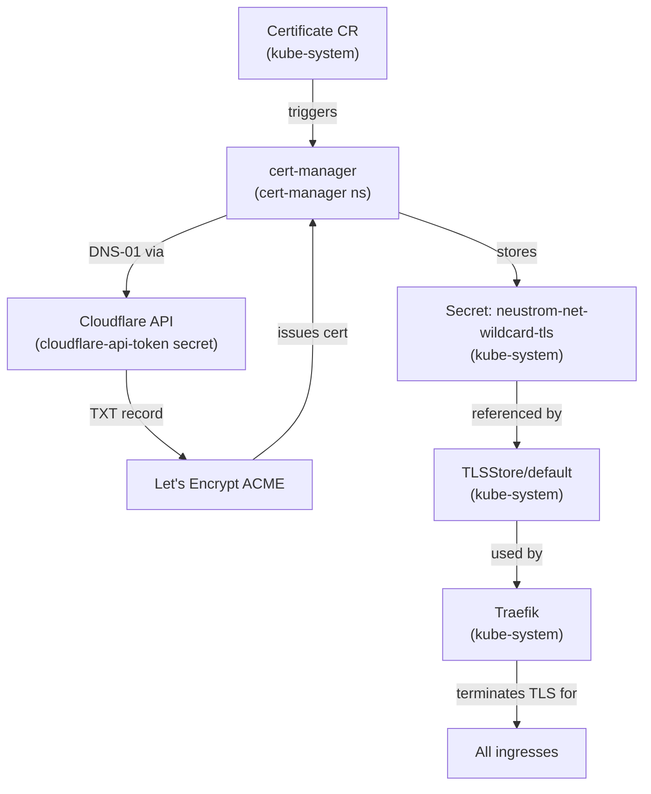

# Certificates Deep-Dive

## Architecture overview



## Components and where they live

| Resource | Kind | Namespace | File |
|---|---|---|---|
| `neustrom-net-wildcard` | `Certificate` | `kube-system` | `applications/vendor/traefik-certs/certificate.yaml` |
| `neustrom-net-wildcard-tls` | `Secret` (tls) | `kube-system` | auto-created by cert-manager |
| `default` | `TLSStore` | `kube-system` | `applications/vendor/traefik-certs/tlsstore.yaml` |
| `letsencrypt` | `ClusterIssuer` | cluster-scoped | `applications/vendor/cert-manager/clusterissuer.yaml` |
| `cloudflare-api-token` | `Secret` (sealed) | `cert-manager` | `applications/vendor/cert-manager/cloudflare-api-token-sealedsecret.yaml` |

## Issuance flow

1. ArgoCD syncs `traefik-certs` → applies `Certificate` resource to `kube-system`
2. cert-manager sees the `Certificate` → creates a `CertificateRequest` and an ACME `Order`
3. cert-manager creates a `Challenge` → calls the Cloudflare API to add a `_acme-challenge.neustrom.net` TXT record
4. Let's Encrypt verifies the TXT record → marks the challenge valid
5. cert-manager removes the TXT record → receives the signed certificate
6. cert-manager stores the cert + private key in `Secret/neustrom-net-wildcard-tls` in `kube-system`
7. Traefik's `TLSStore/default` references that secret → serves it for all HTTPS ingresses

## Checking status

```bash
# Certificate readiness
kubectl get certificate -n kube-system

# Detailed status + events (useful for debugging failed issuance)
kubectl describe certificate neustrom-net-wildcard -n kube-system

# Watch issuance in progress
kubectl get challenge -n kube-system -w

# Verify the secret was created
kubectl get secret neustrom-net-wildcard-tls -n kube-system

# Check ClusterIssuer is Ready
kubectl get clusterissuer letsencrypt
```

## Renewal

cert-manager automatically renews the certificate ~30 days before expiry (Let's Encrypt certs last 90 days). No manual action needed. Renewal follows the same DNS-01 flow as initial issuance.

To force a renewal manually (e.g. after rotating the Cloudflare token):

```bash
kubectl annotate certificate neustrom-net-wildcard -n kube-system \
  cert-manager.io/issuer-name- cert-manager.io/issuer-kind- \
  --overwrite
# Then delete the existing secret to force re-issue:
kubectl delete secret neustrom-net-wildcard-tls -n kube-system
```

## Accessing services locally (/etc/hosts)

The cluster runs locally at `127.0.0.1`. Since `neustrom.net` has no public A record pointing home, browsers can't resolve services via DNS. Add entries to `/etc/hosts` per service:

```
127.0.0.1  argocd.neustrom.net
```

The real Let's Encrypt cert still validates correctly — the browser only checks that the certificate matches the hostname, not that DNS resolves it the same way.

For network-wide access without editing every device's hosts file, add real A records in Cloudflare pointing to the k3s node's LAN IP, or run a local DNS resolver (e.g. Pi-hole) with split-horizon DNS.

## Ingress configuration

Because TLS is terminated globally via `TLSStore/default`, ingresses need **no** `tls:` block and **no** cert-manager annotations. Just specify the hostname:

```yaml
spec:
  rules:
    - host: myservice.neustrom.net
      ...
```

Traefik picks up `TLSStore/default` automatically for all HTTPS traffic. Adding cert-manager annotations (`cert-manager.io/cluster-issuer`) would trigger per-ingress certificate issuance and create redundant certs — do not add them.

## Cluster re-install / migration to RPi

The `neustrom-net-wildcard-tls` Secret is auto-created by cert-manager after re-install. No manual cert migration needed.

What *does* need to be done:

1. Re-deploy Sealed Secrets → run `mise run fetch-cert` to get the new cluster's public key
2. Re-seal `cloudflare-api-token` with `mise run seal-secret` (the old sealed secret is encrypted to the old cluster's key)
3. Push → ArgoCD will bootstrap cert-manager and trigger issuance automatically

## Why kube-system?

The `Certificate` and `TLSStore` live in `kube-system` because Traefik (k3s default) runs there and can only read secrets from its own namespace. cert-manager creates the `Secret` in the same namespace as the `Certificate` resource.

!!! warning
    Do not move the `Certificate` to another namespace without also moving or replicating the resulting secret to `kube-system`. Traefik will silently fall back to its self-signed cert.
